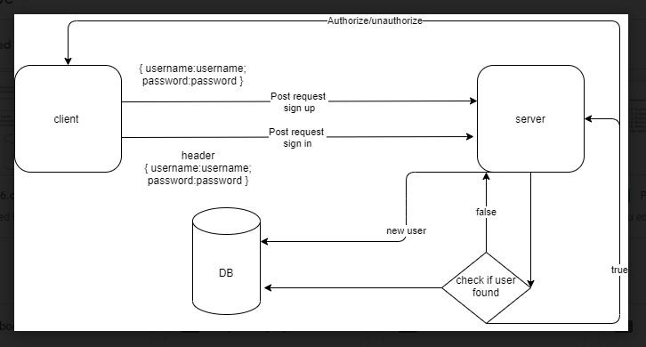

# basic-auth

## setup
### .env
+ PORT
+ POSTGRES_URI
### Dependencies needs to install
- npm init -y
- npm i dotenv express 
- npm i jest supertest 
- npm i sequelize pg
### To Run the Application
- clone the repository
- run the command (nodemon)
### testing :
### Run tests with npm test
### UML 
